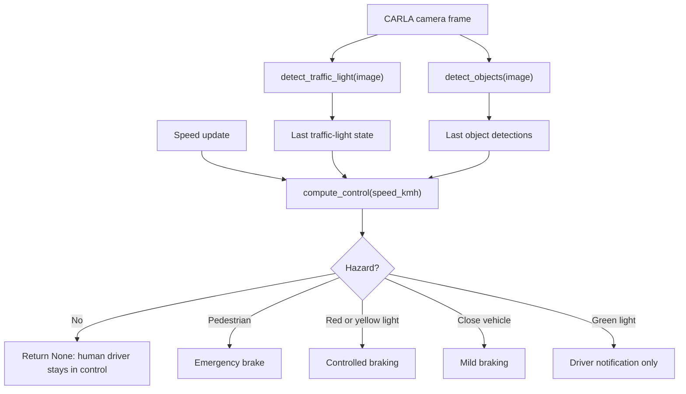
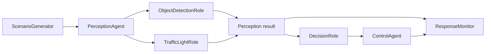
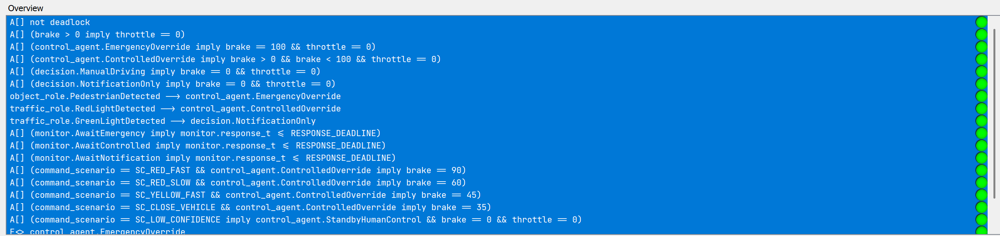
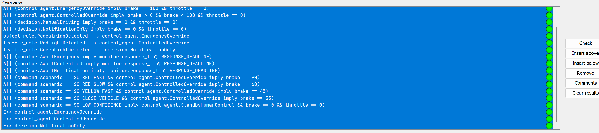

# CARLA Simulator Based Object Detection and ADAS Safety System

This repository contains the final implementation of an Advanced Driver Assistance System (ADAS) for the Hochschule Hamm-Lippstadt CARLA student lab. The system runs in parallel with a human driver in the CARLA simulator and provides traffic-light detection, pedestrian detection, vehicle detection, driver warnings, and limited safety interventions.

The final solution combines:

- A custom-trained YOLOv8 object detection model.
- A CARLA-compatible ADAS implementation in `solution/my_adas.py`.
- A trained model weight file in `solution/best.pt`.
- A Task 3 formal software model in UPPAAL.
- Verifier queries and verification evidence for the ADAS decision behavior.

The trained YOLOv8 model was built using both a public CARLA object detection dataset and lab-collected CARLA data. The control logic was then modeled and verified using UPPAAL timed automata.

---

## Project Objective

The goal of this project was to build an ADAS module that supports a human driver inside the CARLA simulator.

The system is designed to:

- Process live camera frames from the simulator.
- Detect traffic lights, pedestrians, and vehicles.
- Notify the driver about relevant road situations.
- Apply braking only when a high-confidence hazard is detected.
- Avoid unnecessary takeover from the human driver.
- Follow the interface structure required by the HSHL ADAS framework.
- Formally model and verify the safety-critical decision behavior.

The final implementation is intentionally conservative. It avoids braking for weak or uncertain detections and only intervenes for safety-relevant cases such as pedestrians, red lights, yellow lights, and close vehicles.

---

## Repository Highlights

| Area | Main Files |
|---|---|
| ADAS implementation | `solution/my_adas.py` |
| Trained YOLO model | `solution/best.pt` |
| Training notebook | `CARLA_PROJECT_MECHATRONICS_BLOCK_WEEK.ipynb` |
| Python dependency list | `requirements.txt` |
| UPPAAL model | `task3_upaal/Carla_ADAS_Task3_UPPAAL.xml` |
| UPPAAL verifier queries | `task3_upaal/Carla_ADAS_Task3_Verifier_Queries.q` |
| UPPAAL verification evidence | `task3_upaal/evidence/` |
| Task 3 report | `task3_upaal/TASK3_MUML_UPPAAL_REPORT.md` |

---

## System Overview

The ADAS node receives camera frames and speed updates from the CARLA lab framework. A human driver still controls the vehicle, while the ADAS module observes the scene and only intervenes when a hazard is detected.



The live viewer is available at:

```text
http://localhost:8080
```

---

## Final Submitted Files

```text
solution/
|-- my_adas.py
`-- best.pt

requirements.txt
CARLA_PROJECT_MECHATRONICS_BLOCK_WEEK.ipynb
task3_upaal/
```

### File Descriptions

| File | Purpose |
|---|---|
| `solution/my_adas.py` | Main ADAS implementation required by the lab framework |
| `solution/best.pt` | Final trained YOLOv8 model weights |
| `requirements.txt` | Python dependency file containing `ultralytics` |
| `CARLA_PROJECT_MECHATRONICS_BLOCK_WEEK.ipynb` | Notebook for dataset preparation, merging, training, evaluation, and comparison |
| `task3_upaal/` | Task 3 MUML/UPPAAL software modeling and verification artifacts |

---

## Repository Structure

```text
.
|-- adas/
|   |-- interface.py
|   |-- topics.py
|   `-- viewer.py
|
|-- dev_tools/
|   |-- control_logger/
|   |-- play_bag.sh
|   `-- start_ros_node.sh
|
|-- solution/
|   |-- best.pt
|   `-- my_adas.py
|
|-- task3_upaal/
|   |-- Carla_ADAS_Task3_UPPAAL.xml
|   |-- Carla_ADAS_Task3_Verifier_Queries.q
|   |-- TASK3_MUML_UPPAAL_REPORT.md
|   |-- TASK3_MUML_DIAGRAMS.md
|   |-- FORMAL_VERIFICATION_RESULTS.md
|   |-- VALIDATION_NOTES.md
|   |-- FINAL_ACCEPTABILITY_AUDIT.md
|   |-- UPPAAL_IMPORT_AND_VERIFY.md
|   |-- TASK3_SUBMISSION_CHECKLIST.md
|   |-- verifyta_results.txt
|   `-- evidence/
|       |-- UPPAAL_Verifier_Results_01.png
|       `-- UPPAAL_Verifier_Results_02.png
|
|-- tests/
|   |-- test_interface.py
|   |-- test_my_adas.py
|   `-- validate_bag.py
|
|-- CARLA_PROJECT_MECHATRONICS_BLOCK_WEEK.ipynb
|-- Dockerfile
|-- docker-compose.yaml
|-- requirements.txt
|-- session_bag.md
`-- README.md
```

---

## Dataset Used

Two datasets were used for training.

### 1. Public CARLA Dataset

The public CARLA object detection dataset was downloaded from Kaggle:

```text
ibrahimalobaid/object-detection-carla-self-driving-car
```

The notebook prepared this dataset into a clean YOLO format.

| Split | Images | Label Files | Object Lines |
|---|---:|---:|---:|
| Train | 1120 | 1120 | 2028 |
| Validation | 320 | 320 | 557 |
| Test | 160 | 160 | 292 |

### 2. Lab-Collected Dataset

A second dataset was collected in the lab using CARLA data. It was exported in YOLO format and normalized to match the same class order as the public dataset.

| Split | Images |
|---|---:|
| Train | 167 |
| Validation | 33 |
| Test | 22 |

### 3. Final Merged Dataset

The final model was trained using both datasets.

| Source | Split | Images |
|---|---|---:|
| Kaggle | Train | 1120 |
| Kaggle | Validation | 320 |
| Kaggle | Test | 160 |
| Lab | Train | 167 |
| Lab | Validation | 33 |
| Lab | Test | 22 |

Total merged split sizes:

| Split | Images |
|---|---:|
| Train | 1287 |
| Validation | 353 |
| Test | 182 |

---

## Class Labels

The final YOLO dataset uses 10 classes:

```text
0: bike
1: motobike
2: person
3: traffic_light_green
4: traffic_light_orange
5: traffic_light_red
6: traffic_sign_30
7: traffic_sign_60
8: traffic_sign_90
9: vehicle
```

The ADAS control logic mainly uses:

- `person`
- `vehicle`
- `traffic_light_green`
- `traffic_light_orange`
- `traffic_light_red`

Traffic sign classes remain in the trained detector because they are part of the dataset, but they are not used for braking decisions in the final ADAS behavior.

---

## Dataset Preparation

The notebook performs the following preparation steps:

1. Downloads the public CARLA dataset.
2. Inspects image and label folders.
3. Converts the dataset into YOLO format.
4. Uploads the lab-collected YOLO dataset ZIP.
5. Extracts the lab dataset safely in Colab.
6. Fixes Windows-style ZIP paths by replacing backslashes with forward slashes.
7. Merges the public and lab datasets into one YOLO dataset.
8. Writes a new merged `data.yaml`.

The Windows path fix was necessary because the exported lab ZIP contained paths using `\`. Google Colab expects Linux-style paths using `/`.

```python
fixed_name = member.filename.replace("\\", "/")
```

Without this fix, the extracted files were not placed in the expected folder structure and `data.yaml` could not be found.

---

## Final YOLO Training

YOLOv8 was selected because the ADAS system needs real-time object detection. YOLOv8 provides a good balance between inference speed, accuracy, model size, and ease of deployment.

The final model used YOLOv8 nano:

```python
BASE_MODEL = "yolov8n.pt"
EPOCHS = 60
IMG_SIZE = 640
BATCH_SIZE = 16
```

Training was performed in Google Colab using the merged public + lab dataset.

The final training cell used:

```python
model = YOLO("yolov8n.pt")

model.train(
    data=str(MERGED_YAML),
    epochs=60,
    imgsz=640,
    batch=16,
    project=str(RUN_DIR),
    name="hshl_carla_plus_lab_yolov8n_augmented",
    exist_ok=True,
    patience=12,
    mosaic=1.0,
    close_mosaic=10,
    scale=0.50,
    verbose=True,
    plots=True,
)
```

### Augmentation Strategy

Mosaic and scale augmentation were used:

```python
mosaic=1.0
close_mosaic=10
scale=0.50
```

Mosaic augmentation helps the model learn from objects at different positions and scales by combining multiple images into one synthetic training image. Scale augmentation improves robustness for objects appearing at different distances. Mosaic was disabled during the last 10 epochs so the final training phase could stabilize bounding boxes on normal images.

---

## Final Model Performance

The final 60-epoch YOLOv8n model achieved the following validation results on the merged validation set:

| Metric | Value |
|---|---:|
| Precision | 0.947 |
| Recall | 0.874 |
| mAP50 | 0.933 |
| mAP50-95 | 0.697 |

The final model file is:

```text
solution/best.pt
```

The model is small enough for practical use in the CARLA lab environment and is loaded directly by `solution/my_adas.py`.

---

## YOLOv8 Model Comparison

A comparative analysis was performed between three YOLOv8 model sizes:

- YOLOv8n
- YOLOv8s
- YOLOv8m

Each model was trained for 10 epochs on the merged dataset using the same augmentation settings.

| Model | Precision | Recall | mAP50 | mAP50-95 | Approx FPS | Size MB | Training Time Min |
|---|---:|---:|---:|---:|---:|---:|---:|
| YOLOv8n | 0.8707 | 0.7870 | 0.8512 | 0.6108 | 101.85 | 5.96 | 5.09 |
| YOLOv8s | 0.9070 | 0.8411 | 0.8940 | 0.6240 | 61.00 | 21.48 | 6.21 |
| YOLOv8m | 0.8851 | 0.8680 | 0.8895 | 0.6510 | 30.65 | 49.62 | 12.21 |

An ADAS-weighted score was used to select the best practical model:

```text
ADAS score = 0.45 * normalized_mAP50-95
           + 0.35 * normalized_recall
           + 0.20 * normalized_FPS
```

| Model | ADAS Score |
|---|---:|
| YOLOv8n | 0.9396 |
| YOLOv8s | 0.8903 |
| YOLOv8m | 0.8602 |

YOLOv8n was selected because it provided the best balance of speed, model size, and detection quality for real-time ADAS use.

---

## ADAS Implementation

The main implementation is in:

```text
solution/my_adas.py
```

The HSHL framework expects the following functions:

```python
detect_traffic_light(image)
detect_objects(image)
compute_control(speed_kmh)
```

### Model Loading

The code loads the trained YOLO model from:

```text
solution/best.pt
```

It also supports fallback search paths:

```text
solution/best.pt
solution/weights/best.pt
best.pt
```

### YOLO Inference

YOLO inference is run with:

```python
conf=0.45
iou=0.45
```

Additional class-specific thresholds are applied after raw inference.

| Detection Type | Threshold |
|---|---:|
| Traffic light | 0.75 |
| Pedestrian | 0.70 |
| Vehicle | 0.50 |

These thresholds reduce false positive braking from weak detections.

---

## ADAS Decision Logic

The final control behavior is rule-based and conservative.

| Situation | ADAS Action | Return Value |
|---|---|---|
| Pedestrian detected | Emergency brake | `(0.0, 1.0, 0.0)` |
| Red traffic light | Controlled braking | `(0.0, 0.6-0.9, 0.0)` |
| Yellow/orange traffic light | Slowing brake | `(0.0, 0.45, 0.0)` |
| Close vehicle | Mild braking | `(0.0, 0.35, 0.0)` |
| Green traffic light | Notification only | `None` |
| No hazard | Human driver remains in control | `None` |

The implementation never applies throttle and brake at the same time.

### Safety Design Choices

- High confidence threshold for traffic lights.
- High confidence threshold for pedestrians.
- No braking based on color-only traffic-light detection.
- No takeover for green traffic lights.
- No generic braking for every vehicle detection.
- Mild braking only for close vehicles.
- Full braking for pedestrians.
- Cooldown logic for HUD messages to avoid repeated message spam.

---

## Task 3: MUML and UPPAAL Formal Verification

The repository includes Task 3 software modeling and formal verification artifacts in:

```text
task3_upaal/
```

The UPPAAL model represents the ADAS software behavior as timed automata. It focuses on the safety-critical flow from perception to decision to control output.

The model contains timed automata for:

- Scenario generation
- Perception coordination
- Object detection
- Traffic light detection
- Risk decision logic
- Control override behavior
- Response-time monitoring

### UPPAAL Model Flow



### UPPAAL Files

| File | Purpose |
|---|---|
| `task3_upaal/Carla_ADAS_Task3_UPPAAL.xml` | Main UPPAAL timed automata model |
| `task3_upaal/Carla_ADAS_Task3_Verifier_Queries.q` | Verifier properties |
| `task3_upaal/verifyta_results.txt` | Verification output |
| `task3_upaal/TASK3_MUML_UPPAAL_REPORT.md` | Detailed Task 3 modeling report |
| `task3_upaal/TASK3_MUML_DIAGRAMS.md` | MUML-style diagrams and explanations |
| `task3_upaal/FORMAL_VERIFICATION_RESULTS.md` | Summary of formal verification results |
| `task3_upaal/UPPAAL_IMPORT_AND_VERIFY.md` | Instructions for opening and verifying the model in UPPAAL |
| `task3_upaal/FINAL_ACCEPTABILITY_AUDIT.md` | Final consistency and acceptance audit |
| `task3_upaal/evidence/` | Screenshots of UPPAAL verifier results |

### Verification Properties

The UPPAAL verifier checks properties such as:

- The model is deadlock-free.
- Brake and throttle are never active at the same time.
- Pedestrian scenarios lead to emergency braking.
- Red-light scenarios lead to controlled braking.
- Yellow-light scenarios lead to controlled braking.
- Green-light scenarios lead to notification-only behavior.
- Low-confidence detections do not trigger braking.
- Response deadlines are respected.
- Emergency, controlled, and notification modes are reachable.

All 20 verifier properties in `Carla_ADAS_Task3_Verifier_Queries.q` are satisfied.

### Verification Evidence

The following screenshots show the UPPAAL verifier results for the final model.





---

## How to Run the ADAS System

From the repository root:

```bash
docker compose --profile bag up --build
```

Then open:

```text
http://localhost:8080
```

The ADAS node loads:

```text
solution/my_adas.py
solution/best.pt
```

---

## Local Validation

The repository includes tests for the ADAS interface and student implementation.

Run:

```bash
python -m pytest tests/test_my_adas.py -v
```

These tests validate that the required ADAS functions return outputs in the expected format and that control values are within valid ranges.

---

## How to Open the UPPAAL Model

1. Open UPPAAL.
2. Load:

```text
task3_upaal/Carla_ADAS_Task3_UPPAAL.xml
```

3. Open the verifier tab.
4. Load or copy the queries from:

```text
task3_upaal/Carla_ADAS_Task3_Verifier_Queries.q
```

5. Run all verifier queries.

Expected result:

```text
All 20 properties are satisfied.
```

The detailed import and verification instructions are provided in:

```text
task3_upaal/UPPAAL_IMPORT_AND_VERIFY.md
```

---

## Limitations

The project has the following limitations:

1. The lab-collected dataset is relatively small.
2. Traffic lights are often small in the image, making detection harder.
3. The system uses camera and speed information only.
4. LiDAR and depth sensing are not used.
5. Distance estimation is approximated using bounding box size.
6. CARLA lighting and rendering conditions can affect detection quality.
7. The final ADAS decision logic is rule-based.
8. The UPPAAL model abstracts the implementation behavior rather than modeling every Python statement.

---

## Future Improvements

Possible improvements include:

- More lab data collection.
- More balanced examples for red, yellow, and green traffic lights.
- Depth-based distance estimation.
- Lane detection integration.
- Temporal smoothing across frames.
- Multi-frame object tracking.
- More detailed pedestrian risk estimation.
- More simulator testing under different weather and lighting.
- Additional UPPAAL properties for timing, priority, and handover behavior.

---

## Conclusion

This project implements a complete CARLA ADAS pipeline:

- Dataset preparation.
- Public + lab dataset merging.
- YOLOv8 training.
- Model comparison.
- Final model deployment.
- Traffic light detection.
- Pedestrian and vehicle detection.
- Driver warning and control intervention.
- MUML-style software modeling.
- UPPAAL formal verification.

The final submitted ADAS uses a YOLOv8n model trained for 60 epochs on the merged dataset. The model is deployed as `solution/best.pt` and loaded by `solution/my_adas.py`.

The final behavior is safety-focused: the system warns the driver when appropriate and intervenes only for high-confidence hazards. The UPPAAL model verifies that the abstracted ADAS decision behavior satisfies the required safety properties, including deadlock freedom, safe braking behavior, and bounded response time.
