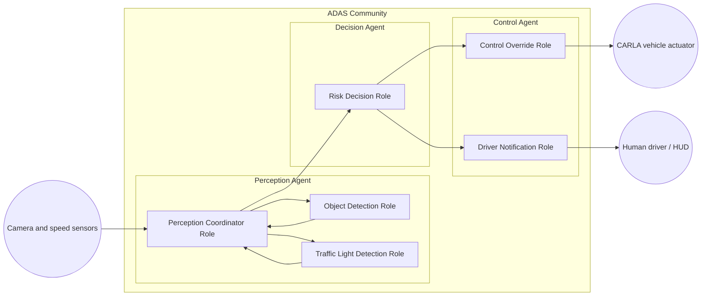
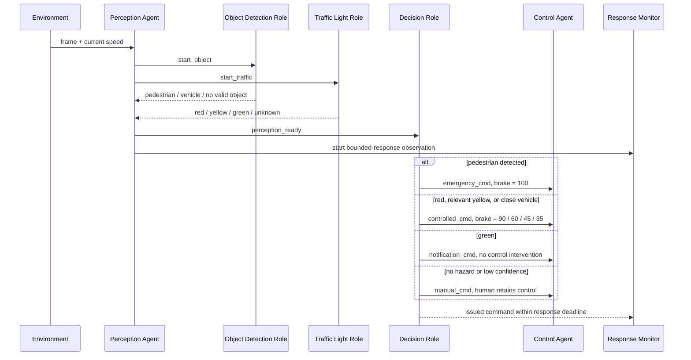
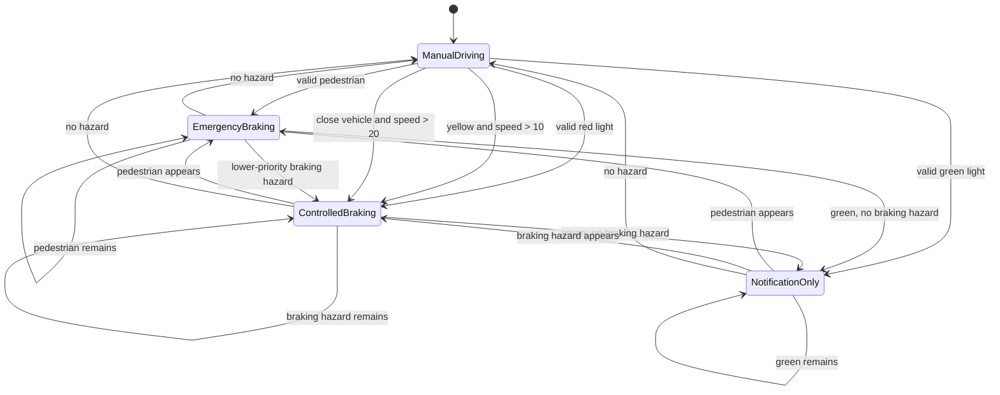
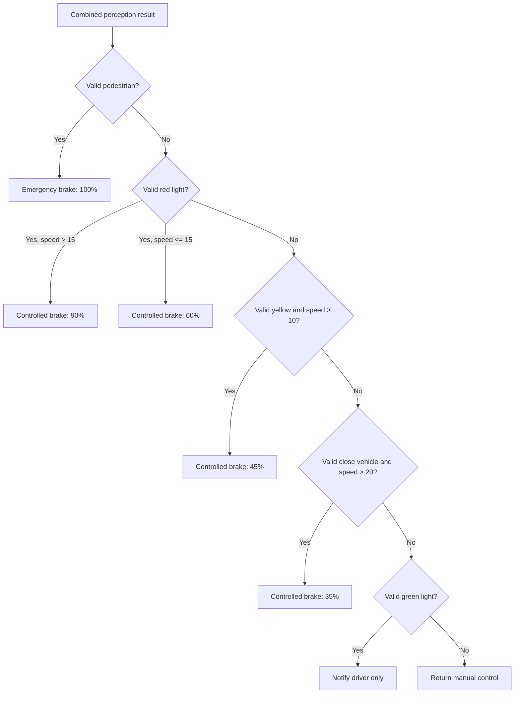

# Task 3 MUML Diagrams

These diagrams document the community, role interactions, and overall agent behavior represented by the UPPAAL timed automata.

## Community and Component Structure

## Role Interaction Sequence

## Overall ADAS State Behavior

## Decision Priority

