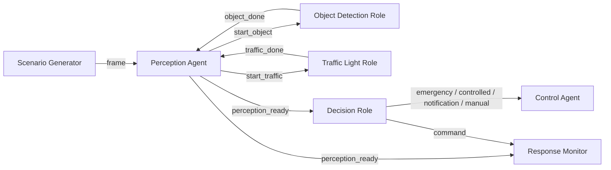

# Task 3: MUML-Based Behavioral Specification and UPPAAL Verification

## CARLA Simulator-Based Object Detection and ADAS Safety System

**Project scope:** A camera-based Advanced Driver Assistance System (ADAS) for CARLA that detects pedestrians, vehicles, and traffic lights, informs the human driver, and temporarily applies braking when a safety-relevant situation is detected.

**Task 3 objective:** Refine the principle solution into a software behavior model, apply MUML concepts, map roles to agents, specify agent behavior, formulate checkable requirements, and verify the resulting behavior with UPPAAL.

---

## 1. Purpose of the UPPAAL Model

UPPAAL is a modeling and verification tool for real-time systems represented as networks of timed automata. A timed automaton consists of locations, transitions, clocks, guards, synchronizations, and assignments.

The model in `Carla_ADAS_Task3_UPPAAL.xml` is an executable abstraction of the final `my_adas.py` control logic. It is not a neural-network accuracy model. Instead, it verifies the safety and timing behavior that follows after a detection result becomes available.

The model answers questions such as:

- Can the composed ADAS behavior deadlock?
- Does a valid pedestrian detection always cause emergency braking?
- Does a valid red-light detection cause controlled braking?
- Can throttle and brake ever be commanded simultaneously?
- Does a green light only notify the driver without taking control?
- Are commands issued within a bounded response time?
- Are all relevant control modes reachable?

---

## 2. System Boundary and Assumptions

### Included

- Generation of representative driving scenarios
- Camera-frame processing coordination
- Object-detection role behavior
- Traffic-light-detection role behavior
- Risk-prioritization and control-decision behavior
- Control override and driver-notification behavior
- Bounded response-time monitoring

### Abstracted

- The trained YOLO neural-network internals
- Pixel-level image processing and bounding-box calculation
- ROS 2 transport details
- CARLA vehicle physics and stopping distance
- Human reaction time

### Modeling assumptions

- One UPPAAL time unit represents one millisecond.
- Camera frames arrive approximately every `67 ms`, corresponding to about `15 fps`.
- Perception processing completes between `5 ms` and `60 ms`.
- Once perception results are published, the decision/control command must be issued within `100 ms`.
- A valid traffic-light event represents a YOLO-sourced detection. This reflects the final code requirement that control actions use a high-confidence YOLO traffic-light result.
- `vehicle_close` abstracts the code's bounding-box-area test (`max_area > 45000`).
- Detection confidence is represented as an integer percentage from `0` to `100`.

The timing bounds are explicit engineering assumptions for verification. The confidence thresholds, speed thresholds, priorities, and braking values are directly derived from `my_adas.py`.

---

## 3. MUML Community and Roles

The ADAS is modeled as a community of cooperating agents. Each agent provides one or more roles.

| Agent | MUML role | Responsibility | UPPAAL template |
|---|---|---|---|
| Environment | Scenario provider | Produces representative sensor situations and vehicle speed | `ScenarioGenerator` |
| Perception Agent | Perception coordination role | Starts detection roles, waits for both results, publishes perception data | `PerceptionAgent` |
| Perception Agent | Object-detection role | Classifies pedestrian, vehicle, or no valid object | `ObjectDetectionRole` |
| Perception Agent | Traffic-light role | Classifies red, yellow, green, or unknown/low-confidence light | `TrafficLightRole` |
| Decision Agent | Risk-decision role | Applies hazard priority and selects manual, notification, controlled brake, or emergency brake | `DecisionRole` |
| Control Agent | Control-override role | Represents the command applied to the vehicle or notification sent to the driver | `ControlAgent` |
| Verification Monitor | Response-time monitor role | Observes decisions and verifies bounded response | `ResponseMonitor` |

### Communication structure



UPPAAL broadcast channels implement the role interactions. This allows one published event to be observed by the relevant decision, control, and monitoring roles.

---

## 4. Timed-Automata Behavior

### 4.1 `ScenarioGenerator`

This template acts as the environment. Every `67 ms`, it nondeterministically selects one representative scenario:

- no hazard
- pedestrian
- red light at high speed
- red light at low speed
- yellow light at high speed
- yellow light at low speed
- green light
- close vehicle
- far vehicle
- low-confidence input

The generator makes every important behavior reachable without hard-coding one test sequence.

### 4.2 `PerceptionAgent`

Behavior:

1. Wait for a camera frame.
2. Start the object-detection role.
3. Start the traffic-light role.
4. Wait until both roles report completion.
5. Publish a combined `perception_ready` event.

The `cycle_t <= PROCESS_MAX` invariant prevents perception processing from waiting indefinitely.

### 4.3 `ObjectDetectionRole`

This role models the relevant output of `detect_objects(image)`:

- `PedestrianDetected` when confidence is at least `70%`
- `VehicleDetected` when confidence is at least `50%`
- `NoValidObject` otherwise

The model separates object recognition from the later decision about whether a detected vehicle is close enough to require braking.

### 4.4 `TrafficLightRole`

This role models the safety-relevant output of `detect_traffic_light(image)`:

- `RedLightDetected`
- `YellowLightDetected`
- `GreenLightDetected`
- `UnknownOrLowConfidence`

A traffic-light result is accepted only when confidence is at least `75%`. Lower-confidence or unrelated input becomes unknown and must not trigger braking.

### 4.5 `DecisionRole`

This role corresponds to `compute_control(speed_kmh)`. The decision priority is:

1. **Pedestrian:** emergency brake `100%`
2. **Red light:** controlled brake `90%` above `15 km/h`, otherwise `60%`
3. **Yellow light:** controlled brake `45%` above `10 km/h`
4. **Close vehicle:** controlled brake `35%` above `20 km/h`
5. **Green light:** driver notification only
6. **No hazard / low confidence / far vehicle:** human remains in control

The priority is encoded by mutually exclusive helper predicates. For example, `need_vehicle_brake()` is false whenever an emergency, red-light, or relevant yellow-light condition exists.

### 4.6 `ControlAgent`

The control agent represents the externally visible system mode:

- `StandbyHumanControl`
- `EmergencyOverride`
- `ControlledOverride`
- `DriverNotification`

Emergency and controlled override always command zero throttle. Notification and manual modes command neither throttle nor brake.

### 4.7 `ResponseMonitor`

The monitor observes a published perception result and waits for the corresponding command. Its clock must remain within the configured `100 ms` response deadline.

---

## 5. Traceability to `my_adas.py`

| Implementation rule | Code-derived value | UPPAAL representation |
|---|---:|---|
| Camera callback frequency | approximately 15 fps | `FRAME_PERIOD = 67` |
| Pedestrian confidence threshold | `0.70` | `PED_CONF_THRESHOLD = 70` |
| Vehicle confidence threshold | `0.50` | `VEH_CONF_THRESHOLD = 50` |
| Traffic-light confidence threshold | `0.75` | `TL_CONF_THRESHOLD = 75` |
| Pedestrian response | `(0.0, 1.0, 0.0)` | brake `100`, throttle `0`, steer `0` |
| Red light above 15 km/h | brake `0.90` | brake `90` |
| Red light at/below 15 km/h | brake `0.60` | brake `60` |
| Yellow above 10 km/h | brake `0.45` | brake `45` |
| Close vehicle above 20 km/h | brake `0.35` | brake `35` |
| Close vehicle criterion | bbox area greater than `45000` | Boolean `vehicle_close` |
| Green light | notification, return `None` | `NotificationOnly`, brake/throttle `0` |
| No hazard | return `None` | `ManualDriving` / `StandbyHumanControl` |
| Control output constraint | never throttle and brake together | verifier safety property |

The other team's example screenshots were used only to understand the expected UPPAAL presentation style. Their confidence threshold of `40%` was not copied. This model uses the final project's actual thresholds.

---

## 6. Refined Checkable Requirements

| ID | Checkable requirement |
|---|---|
| T3-SR-01 | The complete composed system shall be deadlock-free. |
| T3-SR-02 | Brake and throttle shall never be active simultaneously. |
| T3-SR-03 | Emergency override shall always use full braking and zero throttle. |
| T3-SR-04 | Controlled override shall use partial braking and zero throttle. |
| T3-FR-01 | A valid pedestrian detection shall lead to emergency override. |
| T3-FR-02 | A valid red-light detection shall lead to controlled braking. |
| T3-FR-03 | A valid green-light detection shall lead to notification-only behavior. |
| T3-FR-04 | Red light above `15 km/h` shall command `90%` brake. |
| T3-FR-05 | Red light at or below `15 km/h` shall command `60%` brake. |
| T3-FR-06 | Yellow light above `10 km/h` shall command `45%` brake. |
| T3-FR-07 | A close vehicle above `20 km/h` shall command `35%` brake. |
| T3-FR-08 | Manual and notification modes shall not command throttle or brake. |
| T3-TR-01 | Emergency and controlled commands shall be issued within `100 ms` after perception publication. |
| T3-TR-02 | Notification commands shall be issued within `100 ms` after perception publication. |
| T3-RC-01 | Emergency, controlled-braking, and notification modes shall be reachable. |

---

## 7. Verification Queries

The XML contains the verifier queries, and the same queries are also available in `Carla_ADAS_Task3_Verifier_Queries.q`.

Important examples:

```text
A[] not deadlock
A[] (brake > 0 imply throttle == 0)
object_role.PedestrianDetected --> control.EmergencyOverride
traffic_role.RedLightDetected --> control.ControlledOverride
traffic_role.GreenLightDetected --> decision.NotificationOnly
A[] (monitor.AwaitEmergency imply monitor.response_t <= RESPONSE_DEADLINE)
E<> control.EmergencyOverride
```

### Formal verification results

| Property category | Verified result |
|---|---|
| Deadlock freedom | Satisfied |
| No simultaneous throttle and brake | Satisfied |
| Pedestrian causes emergency braking | Satisfied |
| Red light causes controlled braking | Satisfied |
| Green causes notification only | Satisfied |
| Exact braking values | Satisfied |
| Bounded response | Satisfied |
| Reachability of major modes | Satisfied |

The final model was formally checked using UPPAAL 5.0.0 `verifyta`. All twenty properties were satisfied. The complete verifier output is included in `verifyta_results.txt`.

---

## 8. Verification Procedure

1. Open UPPAAL.
2. Select **File > Open System**.
3. Open `Carla_ADAS_Task3_UPPAAL.xml`.
4. Inspect all seven templates in the Editor.
5. Open the **Verifier** tab.
6. Confirm that the embedded queries are visible. If not, load or paste the contents of `Carla_ADAS_Task3_Verifier_Queries.q`.
7. Select **Check All**.
8. Save screenshots showing:
   - the complete template list,
   - `ObjectDetectionRole`,
   - `TrafficLightRole`,
   - `DecisionRole`,
   - `ControlAgent`,
   - all green verifier results.
9. Use the simulator to demonstrate at least:
   - pedestrian to emergency braking,
   - red light to controlled braking,
   - green light to notification only,
   - no hazard to human control.

---

## 9. Limitations and Next Refinements

- The model verifies decision correctness for abstracted perception outcomes; it does not prove neural-network detection accuracy.
- `vehicle_close` abstracts a bounding-box-area heuristic rather than physical distance or time-to-collision.
- Vehicle dynamics and stopping distance are outside the current Task 3 model.
- Notification cooldown behavior is not modeled because it does not change control safety.
- A future model could include sensor faults, stale detections, frame loss, actuator delay, braking dynamics, and human reaction time.

---

## 10. Deliverables

- `Carla_ADAS_Task3_UPPAAL.xml`: complete importable UPPAAL model with embedded queries
- `Carla_ADAS_Task3_Verifier_Queries.q`: verifier-query file
- `TASK3_MUML_UPPAAL_REPORT.md`: Task 3 design and verification report
- `UPPAAL_IMPORT_AND_VERIFY.md`: short operating instructions
